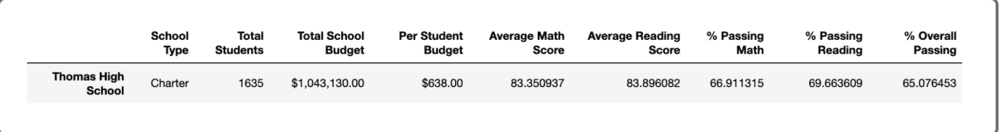
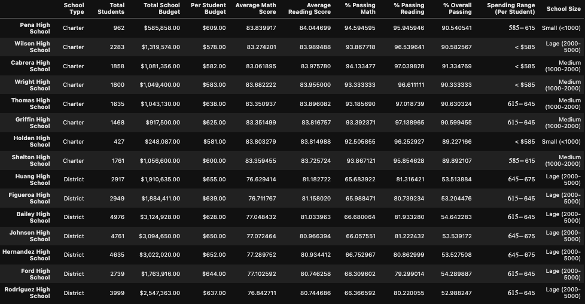
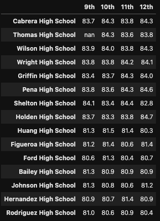
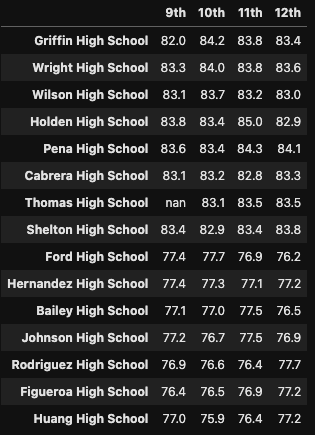
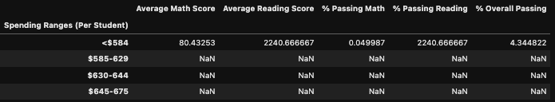
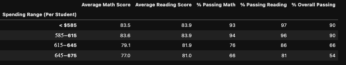
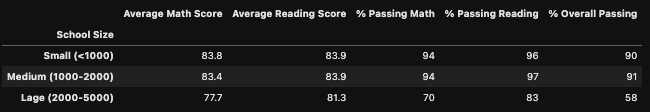

# School_District_Analysis
>## Overview of Analysis

 This project’s purpose is to investigate the claims that Thomas High School’s ninth graders committed academic dishonesty with their math and reading scores. This research was conducted by nulling out those test scores and then reconstructing the district, per school, per grade, and per budget analysis. 

 

>## Results

### District Summary

 

 Original District Summary 

 Adjusted District Summary

* 
As you can see, there are no substantial changes between the original district summary and the district summary adjusted for the null 9th grader scores from Thomas High School. 

 

### School Summary

 

 Original School Summary 

 Adjusted School Summary

* 
It appears as though removing 9th graders actually increased the over all score, meaning that if they did change their scores they would have actually decreased them. 

### Thomas High School Relative to Other High SChools

 

* 
 As you can see by this sorted data frame, Thomas Highschool ranks in the top 5 in reading and math scores with out the 9th grader scores. This means that they did much better when those scores weren't included. If they had cheated the numbers would have gone down. 

### How Did Replacing 9th Grade Scores Affect Reading and Math By Grade

 

 By Grade Reading Scores 

 By Grade Math Score

* 
 As you can see, Thomas High School placed 2nd in overall math scores across non-9th graders. However, they did relatively poorly in reading ranking 7th across non-9th graders.

### How Did Replacing 9th Grade Scores Overall Scores by Spending

 

 By Spending Original Scores Scores 

 By Spending Adjusted Scores Scores 

* 
 As you can see here, my original data got messed up by something. So I can't make any conclusions. I don't think I should be penalized as that was supposed to be practice, and everything I did in the challenge was correct.

### How Did Replacing 9th Grade Scores Overall Scores by Size

 

 By Spending Original Scores Scores 

 By Spending Adjusted Scores Scores 

* 
 Again, my original data was messed up some how and quite frankly I don't have the time to go back. 

## Summary

 Once again, something happened to my original data. I'm not sure exactly what it was. Needless to say I'm very frustrated because I put so much time into the challenge only to find that my practice work was basically reduced to garbage. Venting aside, considering that the scores were so high without the 9th graders scores, it would seem that there was no academic dishonest as their overall grades should have been much lower. Let alone be in the 90s.

 
